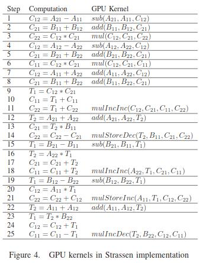
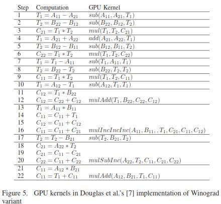

# Курсовой проект по АВС

## Тема проекта

` Перемножение матриц с использованием технологии Cuda`

## Описание проекта

`Разобраться и реализовать несколько разных алгоритмов умножения и сравнить их производительность`


# Пояснительная записка


## Содержание

1. [Перемножение матриц по частям](#Перемножение-матриц-по-частям)
2. [Перемножение матриц с использованием алгоритма Strassen'a](#)


## 1. Перемножение матриц по частям

### Идея

Для матриц помещающихся в глобальную память GPU можно сразу вычислить их произведение с использованием _cuBLAS_ (стандартный функция перемножения матриц в Cuda)/

В обратном случае можно разбить матрицу на блоки, перемножить их, а затем собрать воедино.


### Алгоритм


Пусть есть две матрицы _A_ & _B_ размерами `n x k` & `k x m`.

Разобьём матрицу _A_ на $\lceil \frac{n}{a} \rceil$ частей, где _а_ - количество строк в каждой подматрице. Если для $\lceil \frac{n}{a} \rceil$ой матрицы не хватило строк, то дозаполняем их нулями. 

Таким образом получаем $\lceil \frac{n}{a} \rceil$ матриц размером `a x k` для матрицы _А_ (обозначим $A_{i}$).

Таким же образом разбиваем матрицу _B_, но не по строкам, а по столбцам, т.е. матрица _B_ разбивается на $\lceil \frac{m}{b} \rceil$ подматриц (обозначим $B_{j}$), где _b_ - количество столбцов в каждой подматрице. 

Получаем ещё $\lceil \frac{m}{b} \rceil$ матриц размером `k x b` для матрицы _В_.

Теперь если перемножить матрицы $A_{i} \cdot B_{j}$, то таким образом итоговая матрица будет являться подматрицей ответа с началом в елементе $[a \cdot i, b \cdot j]$, то есть заполнит подматрицу $[a \cdot i, b \cdot j], [(a + 1) \cdot i, b \cdot j], [a \cdot i, (b + 1) \cdot j], [(a + 1) \cdot i, (b + 1) \cdot j]]$


#### Потребление памяти

```cpp
GPU memory usage = (k * (a + b) + a * b) * sizeof(type)
```

Теперь, изменяя _a_ & _b_, можно изменять необходимый объём памяти на GPU.

#### Как можно использовать

Частный случай такого алгоритма, когда матрица _В_ загружается полностью, а матрица _А_ берётся частями, т.е., например, при чтении из файла.

В таком случае можно поблочно считывать из файла матрицу _А_, храня только одну подматрицу, умножать её на матрицу _В_, получать результат в качестве результата `размер блока` строк в итоговой матрице и сразу же записывать её в файла, чтобы также не занимать место.


## 2. Перемножение матриц с использованием алгоритма Strassen'a

### Идея

Идея, схожая с перемножением матриц по частям, лежит в основе работы алгоритма _Strassen'a_.

Данный алгоритм может перемножать матрицы за время $O(n^{\log^{7}_{2}})$ или $O(n^{2.81})$ (кстати, самый быстрые известный алгоритм может перемножать матрицы за время $O(n^{2.38})$).

Начнём с простого.

Разобьём матрицы _А_ и _В_ на 4 равные части (сами матрицы должны быть квадратные и одинаковой размерности), таким же образом представим матрицу _С_. Получим что-то такое:


Тогда, чтобы найти матрицу _С_ можно воспользоваться формулами для умножения матриц:


В таком случае необходимо провести _8 операций умножения и 4 операции сложения_. Причём эти операции умножения мы можем также выполнять с помощью нашего алгоритма и, воспользовавшись рекурсией, пока размер матрицы > 1 (при размере матрицы 1 получается $c = a \cdot b$), вычислить все такие произведения.

Сложность такого алгоритма следующая: на каждый новый вызов нашей фукнции мы уменьшаем проблему в 2 раза, но таких операций у нас 8. Это можно записать следующим образом:

$$T(n) = 8 \cdot T(\frac{n}{2}) + O(n^2)$$

Теперь воспользуемся мастер теоремой:


И получим $a = 8$, $b = 2$, $f(n) = n^2$, это первый случай - $\log_{a}{b} = \log_{2}{8} = 3 > 2$, т.е. сложность такого алгоритма _$O(n^3)$_. Никакого выигрыша не получается.

### Strassen & Winograd

Strassen предложил алгоритм, при котором вместо 8 умножений необходимо сделать всего 7, но количество сложений / вычитаний увеличится до 18.

Свой вариант для решение данной задачи предложил также и Winograd. В его варианте данного алгоритма необходимо провести 7 операций умножения и 15 операций сложения / вычитания, а это немного быстрее, чем у Strassen'a.

В таком случае изменяется формула:

$$T(n) = 7 \cdot T(\frac{n}{2}) + O(n^2)$$

В мастер теореме получаем $a = 7$, $b = 2$, $f(n) = n^2$, это первый случай - $\log_{a}{b} = \log_{2}{7} = 2.81 > 2$, т.е. сложность такого алгоритма _$O(n^{2.81})$_. Это уже поинтереснее, чем $O(n^3)$.

### Сложность

Сложность данного алгоритма: $O(n^{\log_{2}{7}})$.

### Формулы

Strassen предложил вычислять следующим образом:


В свою очередь Winograd предложил так:


### Реализация

#### Одноуровневая

Когда больше не уменьшается размер матрицы, считая, что текущий размер нас удовлетворяет и мы готовы потрать на это $O(n^3)$ операций.





#### Рекурсивная

Когда размер матрицы стоит ещё уменьшить, потому что тратить на умножение $O(n^3)$ ещё дорого.


### Параметры

В реализации рассматривалось две версии:
+ одноуровневая
+ рекурсивная

Переход от рекурсивной к одноуровневой как раз и зависит от параметров.


## Литература

1. https://staff.kfupm.edu.sa/ics/ahkhan/Resources/Papers/Numerical%20Algorithms/strassen_gpu.pdf
2. https://www.youtube.com/watch?v=0oJyNmEbS4w